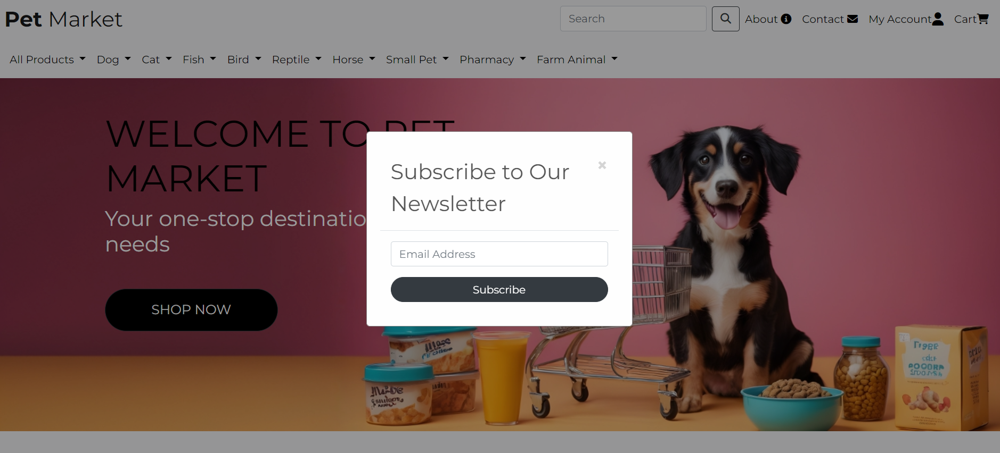
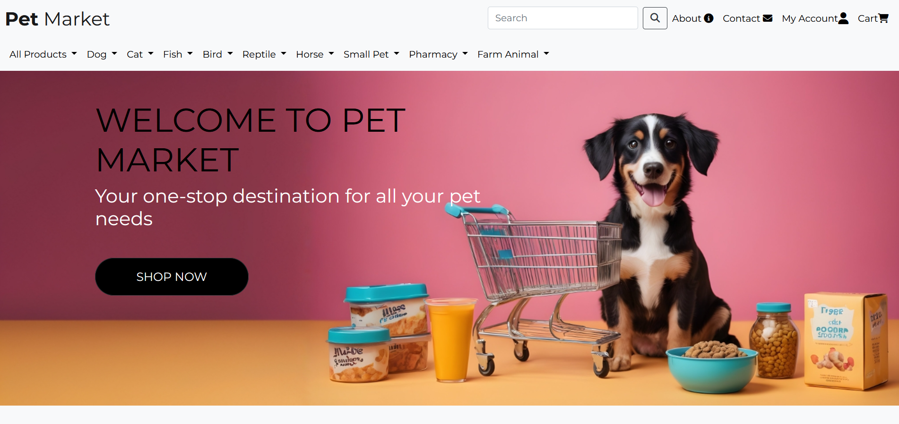
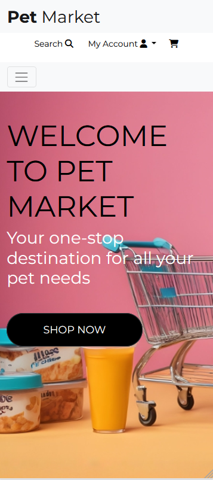

# [Pet Market](https://pet-market-b5febc7e8269.herokuapp.com/)

## UX Design

  ### Project Goals

- **External User's Goal:**
  - Discover holistic and wellness products for pets.
  - Prioritize pets' health and well-being.
  - Seek premium quality and natural ingredients.

- **Site Owner's Goal:**
  - Provide a one-stop platform for pet owners.
  - Offer premium quality, natural, and wellness-focused products.
  - Ensure convenience and accessibility for users.

- **Implementation Strategies:**
  - User-friendly interface and navigation.
  - Detailed product descriptions and ingredient lists.
  - Personalized recommendations and subscription options.
  - Seamless checkout process for enhanced user experience.


  ### User Stories

| User Story ID | As a            | I want to be able to...                                           | So that I can...                                                                                       |
|---------------|-----------------|----------------------------------------------------------------------|-------------------------------------------------------------------------------------------------------|
| Viewing & Navigation  |                 |                                                                      |                                                                                                       |
| 1             | Shopper         | Easily navigate the site                                          | Find products and information that I require                                                          |
| 2             | Shopper         | View products by category                                         | Find specific items I am interested in without having to scroll through all products                   |
| 3             | Shopper         | View details of each product                                      | Learn more about each product                                                                         |
| 4             | Shopper         | View the items I have in my bag                                   | Check whether I still wish to purchase the items and amend the quantity if required                    |
| Registration & User Accounts |              |                                                                      |                                                                                                       |
| 1             | Shopper         | Register an account                                               | Have an account with the site and view my profile                                                     |
| 2             | Shopper         | Receive an email to confirm my registration                       | Verify my account was created successfully                                                           |
| 3             | Shopper         | Log in and out                                                    | Keep my account information secure                                                                    |
| 4             | Shopper         | View a profile page                                               | Set a default delivery address and view previous orders                                               |
| 5             | Shopper         | Reset my password                                                 | Recover my account                                                                                    |
| Sorting and Searching |                 |                                                                      |                                                                                                       |
| 1             | Shopper         | Search for a product by name or description                       | Find a specific product I'd like to purchase                                                          |
| 2             | Shopper         | Find products from a specific category                            | Only see products from that category                                                                  |
| Review        |                 |                                                                      |                                                                                                       |
| 1             | Shopper         | Read product reviews                                              | Find out what other shoppers think about the product                                                  |
| 2             | Shopper         | Add a product review                                              | Share my experience using the product with other shoppers                                              |
| Purchasing & Checkout |             |                                                                      |                                                                                                       |
| 1             | Shopper         | Easily select the quantity of a product when purchasing it        | Ensure I don't accidentally select the wrong product quantity                                          |
| 2             | Shopper         | View all items in my bag                                          | Make sure I haven't accidentally added the wrong product in my bag                                      |
| 3             | Shopper         | Adjust the quantity of individual items in my bag                 | Easily make changes to my purchase before checkout                                                     |
| 4             | Shopper         | Easily enter my payment information                               | Check out quickly and with no hassle                                                                  |
| 5             | Shopper         | Save all address info                                             | I don't have to enter them again on my next order                                                      |
| 6             | Shopper         | View an order confirmation after checkout                         | Make sure my order was successfully placed and double-check that all details are correct                 |
| 7             | Shopper         | Save all orders on my Profile                                     | Easily access all orders anytime                                                                     |
| 8             | Shopper         | Receive an email confirmation after checking out                   | Keep the confirmation of what I've purchased for my records                                           |
| Contact       |                 |                                                                      |                                                                                                       |
| 1             | Shopper         | Contact the admin team                                            | Ask questions about the e-shop                                                                        |
| Admin & Store Management |         |                                                                      |                                                                                                       |
| 1             | Store Owner/Admin | Add a product                                                    | Add new items to my store                                                                              |
| 2             | Store Owner/Admin | Edit a product                                                   | Update product details                                                                                 |
| 3             | Store Owner/Admin | Delete a product                                                 | Remove items that are no longer for sale                                                               |
| 4             | Store Owner/Admin | Delete a product review                                          | Remove product reviews that might have been entered incorrectly                                          |


  ### Wireframes
 
  - [Home Page](./static/images/wireframes/home-page.jpg)
  - [Products](./static/images/wireframes/products.jpg)
  - [Product Details](./static/images/wireframes/product-details.jpg)
  - [Contact](./static/images/wireframes/contact-us.jpg)
  - [About](./static/images/wireframes/about-us.jpg) 
  - [Register](./static/images/wireframes/signup.jpg)
  - [Login](./static/images/wireframes/login.jpg)
 

  ### Database schema

    The website uses seven models as Follws:
  - User 
  - Order 
  - Order Line Item
  - Product 
  - Category
  - Newsletter subscriptions
  - Contact

 
## Features




-  **Navigation Bar**
    The navigation bar changes based on the size of the screen used.
- **Footer**
     

- **Messages - Toasts**  
  This website utilizes Django's messages framework to deliver helpful feedback to users at various points during their interaction through the use of toasts.


- **Home Page**
  Upon arriving at the home page, users are greeted with a welcoming message. Below the welcome message, they can discover the current offers and conveniently access all products with the "Shop" button.
   

- **Products Page**
  The product page showcases individual cards for each product. Users can easily identify the product's name, category, and price. Additionally, superusers have access to delete and edit buttons on the cards.


- **Product Detail Page**
  Clicking on a product card from the products page leads users to the product detail page. Here, users can explore comprehensive details about the product, including reviews from other users. Users also have the option to add the product to their basket and submit a product review.


- **Profile Page**
  Within the profile page, users can save their delivery information for quicker checkout experiences in the future. Additionally, users can view a list of all their previous orders.


- **Cart Page**
  The bag page displays a comprehensive list of all items added to the user's bag. Each product entry includes details such as the product name, price, SKU, quantity, and subtotal. Users can update quantities, remove items, and view the bag's total, including delivery costs if applicable. A "Secure Checkout" button is provided for users to proceed with their order, along with a "Keep Shopping" option.


- **Checkout**
  During the checkout process, users are required to provide their full name, email, delivery information, and payment details to complete their order. An order summary is displayed, showcasing the total cost, delivery fee (if applicable), and grand total.

- **Contact Page**
  Users can access the contact form by clicking the "Contact Us" link located in the footer, accessible from any page. The form allows users to submit queries or questions to the admin team.


- **Product Management for Admin**
  Superusers have access to product management functionalities through the account dropdown menu. This directs them to the "Add Product" page, where they can input details and add new products to the website.

- **Register/Login/Logout**
  All necessary links for registration, login, and logout can be found by clicking on the account icon in the navigation bar. In the event a user forgets their password, they can utilize the "Forgot Password" link on the sign-in page to initiate a password reset process, receiving an email with further instructions.

- **About Page**
  The About page provides users with information about the website, its mission, and its team members. Users can learn more about the site's background and purpose.

- **Newsletter Subscription Page**
  Users can subscribe to the newsletter by providing their email address. Subscribers receive regular updates and notifications about the latest offers, products, and news from the website.

- **Messages from Users Page**
  This page displays messages sent by users through the contact form. Admins can review and respond to these messages, providing assistance or addressing inquiries submitted by users.


  ### Future Implementations

- **Introduce Wishlist Feature**: Enable users to save their preferred prints for convenient access during subsequent visits to the website.
- **Enable Photo Submission with Reviews**: Provide users with the ability to include images showcasing how they utilized the print to embellish their surroundings.
- **Distribute Newsletters to Users**: Offer all users the opportunity to subscribe to newsletters, ensuring they stay informed about the newest promotions and updates.
- **Integrate Webhooks**: Implement webhooks to enable real-time communication between your website and external services or applications.


## Technologies Used

- Database Used
  - [sqlite3](https://docs.python.org/3/library/sqlite3.html) - used for development
  - [ElephantSQL](https://www.elephantsql.com/) - used for deployment
- Languages Used
  - [HTML](https://en.wikipedia.org/wiki/HTML) 
  - [Javascript](https://www.javascript.com/)
  - [CSS](https://en.wikipedia.org/wiki/CSS)  
- Frameworks Used
  - [Bootsrap](https://getbootstrap.com/) - used for styling and responsiveness
  - [Django](https://www.djangoproject.com/) - used to simplify development  
- Stripe
  - [Stripe](https://stripe.com/gb) - used in the project to implement the payment system 
- Libraries & Packages Used
  - [jQuery](https://jquery.com/)
  - [django_crispy_forms](https://pypi.org/project/django-crispy-forms/) - provides a tag and filter that lets you quickly render forms
  - [Django-Allauth](https://django-allauth.readthedocs.io/en/latest/installation.html) -  used to simplify user authentication, registration, account management
  - [django-countries](https://pypi.org/project/django-countries/) - dropdown list of countries used on checkout
  - [Font Awesome](https://fontawesome.com/) - used for all the icons on the site
  - [gunicorn](https://pypi.org/project/gunicorn/) - a Python WSGI HTTP Server
  - [dj_databsae_url](https://pypi.org/project/dj-database-url/) - allows us to utilise the DATABASE_URL variable
  - [pillow](https://pypi.org/project/Pillow/) - Python imaging library
   - [django-storages](https://pypi.org/project/django-storages/) - a storage backend library
  - [psycopg2](https://pypi.org/project/psycopg2/) - a postgres database adapter which allow us to connect with a postgres database
  - [boto3](https://pypi.org/project/boto3/) - Allows connection to AWS S3 bucket
- Programs Used
  - [Git](https://git-scm.com/) - used for version control.
  - [GitHub](https://github.com/) - used o save and store the files for this project.
  - [Favicon](https://favicon.io/) used to create the favicon
  - [Lucidchart](https://lucid.app/) - used to create the database schema
  - [Google Dev Tools](https://developer.chrome.com/docs/devtools/) - used to troubleshoot, test features and solve issues with responsiveness and styling.


## Testing

### Testing for user Stories

| User Story ID | As a       | I want to be able to...                                         | So that I can...                                                                                     | Test Status |
|---------------|------------|----------------------------------------------------------------|-----------------------------------------------------------------------------------------------------|-------------|
| Viewing & Navigation  |            |                                                                |                                                                                                     |             |
| 1             | Shopper    | Easily navigate the site                                        | Find products and information that I require                                                        | [X] Passed  |
| 2             | Shopper    | View products by category                                       | Find specific items I am interested in without having to scroll through all products                 | [X] Passed  |
| 3             | Shopper    | View details of each product                                    | Learn more about each product                                                                       | [X] Passed  |
| 4             | Shopper    | View the items I have in my bag                                 | Check whether I still wish to purchase the items and amend the quantity if required                  | [X] Passed  |
| Registration & User Accounts |          |                                                                |                                                                                                     |             |
| 1             | Shopper    | Register an account                                             | Have an account with the site and view my profile                                                   | [X] Passed  |
| 2             | Shopper    | Receive an email to confirm my registration                     | Verify my account was created successfully                                                         | [X] Passed  |
| 3             | Shopper    | Log in and out                                                  | Keep my account information secure                                                                  | [X] Passed  |
| 4             | Shopper    | View a profile page                                             | Set a default delivery address and view previous orders                                             | [X] Passed  |
| 5             | Shopper    | Reset my password                                               | Recover my account                                                                                  | [X] Passed  |
| Sorting and Searching |          |                                                                |                                                                                                     |             |
| 1             | Shopper    | Search for a product by name or description                     | Find a specific product I'd like to purchase                                                        | [X] Passed  |
| 2             | Shopper    | Find products from a specific category                          | Only see products from that category                                                                | [X] Passed  |
| Review        |            |                                                                |                                                                                                     |             |
| 1             | Shopper    | Read product reviews                                            | Find out what other shoppers think about the product                                                | Future      |
| 2             | Shopper    | Add a product review                                            | Share my experience using the product with other shoppers                                            | Future      |
| Purchasing & Checkout |        |                                                                |                                                                                                     |             |
| 1             | Shopper    | Easily select the quantity of a product when purchasing it      | Ensure I don't accidentally select the wrong product quantity                                        | [X] Passed  |
| 2             | Shopper    | View all items in my bag                                        | Make sure I haven't accidentally added the wrong product in my bag                                    | [X] Passed  |
| 3             | Shopper    | Adjust the quantity of individual items in my bag               | Easily make changes to my purchase before checkout                                                   | [X] Passed  |
| 4             | Shopper    | Easily enter my payment information                             | Check out quickly and with no hassle                                                                | [X] Passed  |
| 5             | Shopper    | Save all address info                                           | I don't have to enter them again on my next order                                                    | [X] Passed  |
| 6             | Shopper    | View an order confirmation after checkout                       | Make sure my order was successfully placed and double-check that all details are correct               | [X] Passed  |
| 7             | Shopper    | Save all orders on my Profile                                   | Easily access all orders anytime                                                                     | [X] Passed  |
| 8             | Shopper    | Receive an email confirmation after checking out                 | Keep the confirmation of what I've purchased for my records                                           | [X] Passed  |
| Contact       |            |                                                                |                                                                                                     |             |
| 1             | Shopper    | Contact the admin team                                          | Ask questions about the e-shop                                                                      | [X] Passed  |
| Admin & Store Management |      |                                                                |                                                                                                     |             |
| 1             | Store Owner/Admin | Add a product                                                  | Add new items to my store                                                                            | [X] Passed  |
| 2             | Store Owner/Admin | Edit a product                                                 | Update product details                                                                               | [X] Passed  |
| 3             | Store Owner/Admin | Delete a product                                               | Remove items that are no longer for sale                                                             | [X] Passed  |
| 4             | Store Owner/Admin | Delete a product review                                        | Remove product reviews that might have been entered incorrectly                                        | Future  |

### Testing for Accessibilty


1. **Interactive Elements:**
   - **Issue Identified:** Some buttons and links on the website weren't easy to use for people who can't use a mouse or see the screen. They didn't respond well when using only a keyboard or a screen reader.
   - **Solution Implemented:** The buttons and links were fixed to work better with keyboards and screen readers. Now, they show clear focus and have descriptive labels, making it easier for everyone to navigate the site.

2. **Inadequate Contrast Ratios:**
   - **Issue Identified:** Some text on the website was hard to read because it didn't stand out enough from the background. This made it tough for people with vision problems to understand.
   - **Solution Implemented:** I adjusted the colors to make sure there's enough contrast between the text and background. Now, the text is clearer and easier to read for everyone, including those with vision issues.

3. **Semantic HTML:**
   - **Issue Identified:** Parts of the website had messy code that made it confusing for screen readers to understand. This could make it harder for people using screen readers to navigate the site.
   - **Solution Implemented:** I cleaned up the code to make it more organized and understandable. Now, screen readers can easily interpret the content, making it simpler for everyone to browse the website.


| Page Name   | Accessibility Score | Desktop View                                                | Mobile View                                                 |
|-------------|----------------------|-------------------------------------------------------------|-------------------------------------------------------------|
| Home        | 100                  | [Link](./static/images/accessibility_test/home-desktop.png) | [Link](./static/images/accessibility_test/home-mobile.png) |
| Products    | 100                  | [Link](./static/images/accessibility_test/products-desktop.png) | [Link](./static/images/accessibility_test/products-mobile.png) |
| About       | 100                  | [Link](./static/images/accessibility_test/about-desktop.png) | [Link](./static/images/accessibility_test/about-mobile.png) |
| Contact     | 100                  | [Link](./static/images/accessibility_test/contact-desktop.png) | [Link](./static/images/accessibility_test/cart-mobile.png) |
| Messages    | 100                  | [Link](./static/images/accessibility_test/messages-desktop.png) | [Link](./static/images/accessibility_test/messages-mobile.png) |
| My Profile  | 100                  | [Link](./static/images/accessibility_test/my-profile-desktop.png) | [Link](./static/images/accessibility_test/messages-mobile.png) |
| Cart        | 100                  | [Link](./static/images/accessibility_test/cart-desktop.png) | [Link](./static/images/accessibility_test/cart-mobile.png) |
| Newsletters | 100                  | [Link](./static/images/accessibility_test/newsletter-desktop.png) | [Link](./static/images/accessibility_test/newsletter-mobile.png) |


### Testing for responsiveness

To make the Pet Market project look good on different devices, I used Bootstrap and media queries. Here's how I did it:

1. **Bootstrap Framework:**
   - I used Bootstrap to help organize the layout of the website. It provides tools to make sure elements adjust well on different screen sizes.
   - With Bootstrap, I could easily create responsive layouts by dividing the page into rows and columns, making sure everything looks good on both large screens and small devices.

2. **Media Queries:**
   - I also wrote custom CSS code called media queries. These queries check the size of the screen and apply specific styles accordingly.
   - For example, I adjusted font sizes and spacing to make sure the content is easy to read and looks good on phones, tablets, and desktops.

3. **Viewport Meta Tag:**
   - I added a special tag in the HTML code called the viewport meta tag. It helps browsers understand how to fit the website's content on different screen sizes.
   - This tag ensures that the website scales properly and looks good on all devices, preventing users from having to zoom in or scroll horizontally.

By combining Bootstrap, media queries, and the viewport meta tag, I made sure that the Pet Market website is user-friendly and looks great no matter what device people are using to access it.

<div style="text-align: center;">
    <h2>Desktop View</h2>
    <p>This content is centered on the page for desktop view.</p>
</div>



<div style="text-align: center;">
    <h2>Tablet View</h2>
    <p>This content is centered on the page for desktop view.</p>
</div>


<div style="text-align: center;">
    <h2>Mobile View</h2>
    <p>This content is centered on the page for desktop view.</p>
</div>



### Validation of codes

1. **JavaScript - JSHint:**
   - To check my JavaScript code for errors and style issues, I used a tool called JSHint.
   - JSHint scans through my JavaScript files and flags any potential problems it finds, such as syntax errors or coding style violations.
   - By running my JavaScript code through JSHint, I ensure it follows coding best practices and is free of common mistakes.

2. **HTML - W3C:**
   - For validating my HTML code, I relied on a service provided by the World Wide Web Consortium (W3C).
   - This service checks my HTML markup against established standards set by W3C, ensuring it's well-formed and compliant.
   - By submitting my HTML code to the W3C validator, I can identify and fix any errors or inconsistencies, improving the quality and accessibility of my web pages.

3. **CSS - Jigsaw:**
   - To validate my CSS stylesheets, I used a tool called Jigsaw CSS Validation.
   - Jigsaw examines my CSS files for syntax errors and adherence to CSS standards.
   - By validating my CSS code with Jigsaw, I ensure it's properly structured and follows best practices, resulting in consistent and maintainable styling across my website.

4. **Python - Flake8:**
   - For checking my Python code, I employed Flake8, a popular Python linter.
   - Flake8 scans through my Python scripts and identifies issues related to coding style and potential errors.
   - By running my Python code through Flake8, I maintain a clean and consistent coding style, making it easier to read and understand for both me and other.


## Deployment
The project is deployed on Heroku following the steps bellow:

### Create the Database

Sqlite3 was used in development but cannot be used for the deployed project. An ElephantSQL database was created following the steps bellow:
- Go to the ElephantSQL, create an account and log in and access your dashboard
- Click on the “Create New Instance” button
- Set up your plan
  - Provide a Name for your plan (typically the project's name).
  - Choose the Tiny Turtle (Free) plan.
  - You can leave the Tags field empty.
- Select “Select Region”
- Select a data center near you
- Then click on “Review”
- Check your details are correct and then click “Create instance”
- Return to the ElephantSQL dashboard and click on the database instance name for this project
- In the URL section, you can click the copy icon to copy the database URL to your clipboard.

### Create a new Heroku app

- Go to Heroku's website, create an account, login and click to create a new app
- Provide a unique name for your app and select the region closest to you. Once done, click "Create app" to confirm.
- Open the Settings tab
- Add the config var DATABASE_URL, and for the value, copy in your database url from ElephantSQL. It should look something like this. Do not add quotation marks around your database url string.

### Project preparation in IDE
- Install dj_database_url and psycopg2 in the terminal. Both packages are required to connect to your external database.
```
 pip3 install dj_database_url==0.5.0 psycopg2
```
- Update your requirements.txt file with the newly installed packages
```
 pip freeze > requirements.txt
```
- In your settings.py file, import dj_database_url underneath the import for os
```
 import os
 import dj_database_url
```
- Scroll to the DATABASES section and update it with the following code. Comment out the original connection to sqlite3 and connect to the new ElephantSQL database instead. Paste your ElephantSQL database URL in the indicated position.
```
# DATABASES = {
 #     'default': {
 #         'ENGINE': 'django.db.backends.sqlite3',
 #         'NAME': os.path.join(BASE_DIR, 'db.sqlite3'),
 #     }
 # }
     
 DATABASES = {
     'default': dj_database_url.parse('your-database-url-here')
 }
```
DO NOT commit this file with your database string in the code, this is temporary so that we can connect to the new database and make migrations. We will remove it in a moment.

- In the terminal, run the showmigrations command to confirm you are connected to the external database
```  
python3 manage.py showmigrations
```
- Migrate your database models to your new database
``` 
 python3 manage.py migrate
```
- Load in the fixtures. Note that the order is crucial here, as categories need to be loaded first.
```
 python3 manage.py loaddata categories
```
- Then products, as the products require a category to be set
```
python3 manage.py loaddata products
```
- Create a superuser for your new database
```  
python3 manage.py createsuperuser
```
- You should now be able to navigate to the browser tab on the left side of the page in ElephantSQL, click the "Table queries" button, and view the user you've just created by selecting the auth_user table.
- We can now add an if/else statement for the databases in settings.py. This allows us to use the development database while in development (the code we commented out) and the external database on the live site. Note the change where the database URL was is now a variable we will use in Heroku:
```
if 'DATABASE_URL' in os.environ:
    DATABASES = {
      'default': dj_database_url.parse(os.environ.get('DATABASE_URL'))
    }
else:
    DATABASES = {
        'default': {
            'ENGINE': 'django.db.backends.sqlite3',
            'NAME': os.path.join(BASE_DIR, 'db.sqlite3')
      }
    }
```
- Install gunicorn which will act as our webserver and freeze this to the requirements.txt file:
```
pip3 install gunicorn
pip3 freeze > requirements.txt
```
- Create a Procfile in the root directory. This file instructs Heroku to create a web dyno that runs gunicorn and serves our Django app. Add the following to the file (ensuring not to leave any blank lines underneath):
```
web: gunicorn seaside_sewing.wsgi:application
```
- Log into the Heroku CLI in the terminal and then run the following command to disable collectstatic. This command instructs Heroku not to collect static files during deployment:
``` 
heroku config:set DISABLE_COLLECTSTATIC=1 --app heroku-app-name-here
```
- We will also need to add the Heroku app and localhost (which will allow gitpod to still work) to ALLOWED_HOSTS = [] in settings.py
```
ALLOWED_HOSTS = ['{heroku deployed site URL here}', 'localhost' ]
```
- Save, add, commit, and push the changes to GitHub. Then, you can initialize the Heroku git remote in the terminal and push to Heroku with the following command:
```
heroku git:remote -a {app name here}
git push heroku master
```
- You should now be able to view the deployed site (without any static files as we haven't set these up yet).
- To enable automatic deploys on Heroku, go to the deploy tab and click the connect to GitHub button in the deployment method section. Search for the projects repository and then click connect. Click enable automatic deploys at the bottom of the page.

### Generate a SECRET_KEY & Updating Debug

- Django automatically sets a secret key when you create your project. However, it's not advisable to use this default key in the deployed version, as it can leave the site vulnerable. Instead, we can use a random key generator to create a new SECRET_KEY. Then, add this new key to our Heroku config vars to keep it protected.
- Create a new key and copy the value.
- In Heroku settings create a new config var with a key of SECRET_KEY. The value will be the secret key we just created. Then Click add.
- In settings.py, we can now update the SECRET_KEY variable to retrieve the secret key from the environment, or use an empty string in development:
```
SECRET_KEY = os.environ.get('SECRET_KEY', ' ')
```
- We can now adjust the DEBUG variable to only set DEBUG as true if in development:
```
DEBUG = 'DEVELOPMENT' in os.environ
```
- Save, add, commit and push these changes.

### Set up AWS hosting for static and media files

- Sign up or log in to your AWS Amazon account by using the "Manage My Account" button at the top right. Then, navigate to S3 to create a new bucket.
- The bucket will be used to store our files, so it's a good idea to name this bucket the same as your project. Select the region closest to you. In the Object Ownership section, enable ACLs and select Bucket owner preferred. In the Block Public Access section, uncheck the "Block all public access" box. You will then need to acknowledge that you're making the bucket public. Finally, click "Create bucket".
- Click the bucket you've just created and then select the properties tab at the top of the page. Find the static web hosting section and choose enable static web hosting, host a static website and enter index.html and error.html for both the index and error documents (these won't actually be used.)
- Open the Permissions tab and copy the ARN (Amazon Resource Name). Navigate to the Bucket Policy section, click Edit, and select Policy Generator. Choose the Policy Type as "S3 Bucket Policy". Allow all principles by adding * to the input and the actions will be get object. Paste the ARN copied from the last page into the ARN input and click "Add Statement". Then, click "Generate Policy" and copy the policy that displays in a new pop-up. Paste this policy into the Bucket Policy Editor and make the following changes: Add a /* at the end of the resource value. Then Click save.
- Next we need to edit the the cross-origin resource sharing (CORS). Paste in the following text:
```
[
    {
        "AllowedHeaders": [
            "Authorization"
        ],
        "AllowedMethods": [
            "GET"
        ],
        "AllowedOrigins": [
            "*"
        ],
        "ExposeHeaders": []
    }
]
```
- Now we need to edit the access control list (ACL) section. Click edit and enable list for everyone(public access) and accept the warning box.

### Creating AWS groups, policies and users

- Click the services icon on the top right of the page and navigate to IAM - manage access to AWS services. On the left hand navigation menu click user groups and then click the create group button in the top right. This will create the group that our user will be placed in.
- Choose a name for your group - for example manage-seaside-sewing, and click the create policy button on the right. This will open a new page.
- Click on the JSON tab and then click the link for import managed policy on the top right of the page.
- Search for S3 and select the one called AmazonS3FullAccess, then click import.
- We need to make a change to the resources, we need to make resources an array and then change the value for resources. Instead of a * which allows all access, we want to paste in our ARN. followed by a comma, and then paste the ARN in again on the next line with /* at the end. This allows all actions on our bucket, and all the resources in it.
- Click the next: tags button and then the next:review 
- Give the policy a name and description. Click the create policy button.
- Now we need to attach the policy we just created. On the left hand navigation menu click user groups, select the group and go to the permissions tab. Click the add permissions button on the right and choose attach policies from the dropdown menu.
- Select the policy you just created and then click add permissions at the bottom.
- Now we'll create a user for the group by clicking on the user link in the left hand navigation menu, clicking the add users button on the top right and giving our user a username. Select programamtic access and then click the next: permissions button.
- Add the user to the group you just created and then click next:tags button, next:review button and then create user button.
- You will now need to download the CSV file, as it contains the user access key and secret access key required for insertion into the Heroku config vars. Ensure you download the CSV now, as you won't be able to access it again later.

### Connecting Django to our S3 bucket

- Install boto3 and django storages and freeze them to the requirements.txt file.
```
pip3 install boto3
pip3 install django-storages
pip3 freeze > requirements.txt
```
- Add storages to the installed apps in settings.py
- Add the following code in settings.py to use our bucket if we are using the deployed site:
```
if 'USE_AWS' in os.environ:
    AWS_S3_OBJECT_PARAMETERS = {
        'Expires': 'Thu, 31 Dec 2099 20:00:00 GMT',
        'CacheControl': 'max-age=9460800',
    }
    
    AWS_STORAGE_BUCKET_NAME = 'enter your bucket name here'
    AWS_S3_REGION_NAME = 'enter the region you selected here'
    AWS_ACCESS_KEY_ID = os.environ.get('AWS_ACCESS_KEY_ID')
    AWS_SECRET_ACCESS_KEY = os.environ.get('AWS_SECRET_ACCESS_KEY')
    AWS_S3_CUSTOM_DOMAIN = f'{AWS_STORAGE_BUCKET_NAME}.s3.amazonaws.com'
```
- We can now go to Heroku and add the following config vars:
  - **AWS_ACCESS_KEY_ID** - *The access key value from the amazon csv file downloaded in the last section*
  - **AWS_SECRET_ACCESS_KEY** - *The secret access key from the amazon csv file downloaded in the last section*
  - **USE_AWS** - *True*
- Remove the DISABLE_COLLECTSTATIC variable.
- Create a file called custom_storages.py in the root and import settings and S3Botot3Storage. Create a custom class for static files and one for media files. These classes will specify the location to store static and media files.
- Add the following to settings.py to let the app know where to store static and media files, and to override the static and media URLs in production.
```
STATICFILES_STORAGE = 'custom_storages.StaticStorage'
STATICFILES_LOCATION = 'static'
DEFAULT_FILE_STORAGE = 'custom_storages.MediaStorage'
MEDIAFILES_LOCATION = 'media'

STATIC_URL = f'https://{AWS_S3_CUSTOM_DOMAIN}/{STATICFILES_LOCATION}/'
MEDIA_URL = f'https://{AWS_S3_CUSTOM_DOMAIN}/{MEDIAFILES_LOCATION}/'
```
- Save, add, commit and push these changes to make a deployment to heroku. In the build log you should be able to see that the static files were collected, and if we check our S3 bucket we can see the static folder which has all the static files in it.
- Navigate to S3 and open your bucket. To create a new folder to hold all the media files for our site, click the "Create folder" button on the top right and naming the folder media.

### Setting up Stripe

- We now need to add our Stripe keys to our config vars in Heroku to keep these out of our code and maintain their privacy. Log into Stripe, click on Developers, and then select API keys.
- Create 2 new variables in Heroku's config vars - for the publishable key (STRIPE_PUBLIC_KEY) and the secret key (STRIPE_SECRET_KEY) and paste the values in from the Stripe page.
- Now we need to add the webhook endpoint for the deployed site. Navigate to the webhooks link in the left hand menu and click add endpoint button.
- Add the URL for our deployed sites webhook, give it a description and then click the add events button and select all events. Click Create endpoint.
- Now we can add the webhook signing secret to our Heroku config variables as STRIPE_WH_SECRET.
- In settings.py:
```
STRIPE_PUBLIC_KEY = os.getenv('STRIPE_PUBLIC_KEY', '')
STRIPE_SECRET_KEY = os.getenv('STRIPE_SECRET_KEY', '')
STRIPE_WH_SECRET = os.getenv('STRIPE_WH_SECRET', '')
```


[Back to top](#Table-of-contents)

---

## Superuser credentials/ Superuser credentials

+ username- nadeeshan
+ password-ladee1111

## Credits
### Code
  - Boutique Ado walk-through project from [Code Institute](https://codeinstitute.net/)
  - [Bootstrap Docs](https://getbootstrap.com/docs/5.0/getting-started/introduction/)
  - [Django-Allauth Documentation](https://django-allauth.readthedocs.io/en/latest/installation.html)
  - [Stack Overflow](https://stackoverflow.com/)
  - [CSS Tricks](https://css-tricks.com/)
  - youtube tuorial insparations

### Content

  - [Sample dataset](https://www.chewy.com/)
  - [Background Image](https://www.freepik.com/)
 

### Media

1. Icons and footer icons were taken from Font Awesome and bootstrap Icons.
2. Google Fonts used in the website
3. jQuery library used throughout the code.
4. w3schools was used as a general source of knowledge


### Acknowledgements

+ Creating a README(How to put together a well-documented README for your projects) by Code Institute
+ I would like to acknowledge my mentor Rory Patrick for his review and valuable feedback throughout the project.
+ I would like to thank my wife for testing the application and feedback.

## Disclaimer

This project was developed for educational purposes as part of the Code Institute's Full Stack Frameworks with Django module.


### For Information

I encountered difficulties with GitHub during the course of this project. My original GitHub account was hijacked, likely due to a virus on my laptop. Initially, I believed I would regain access within two weeks, so I took a temporary leave from the project. However, I did not hear back from the GitHub team within the expected timeframe. Consequently, I decided to start the project again using a new GitHub account, after informing my mentor and the student care team about my decision.

Unfortunately, just three days before the project submission deadline, my new account was flagged. Fortunately, with the help of my mentor, I was able to regain access to my old account. I promptly transferred the project files to my old account and continued working on the project.

If you have any doubts regarding commits or users associated with this project, please feel free to contact me. I am more than happy to provide any necessary proof regarding the issues I faced with my GitHub accounts.

old account-hpatnadeeshan(hpatnadeeshan@gmail.com)-finally submitted from this account
new account-tnadeeshan(hpatnadeeshan12@gmail.com)
I used VS code as IDE since these issues.